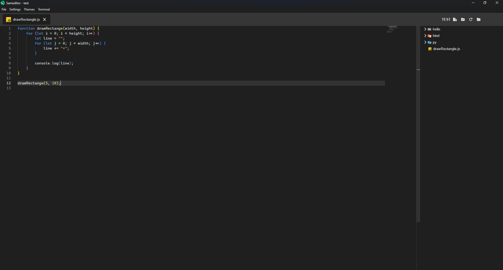
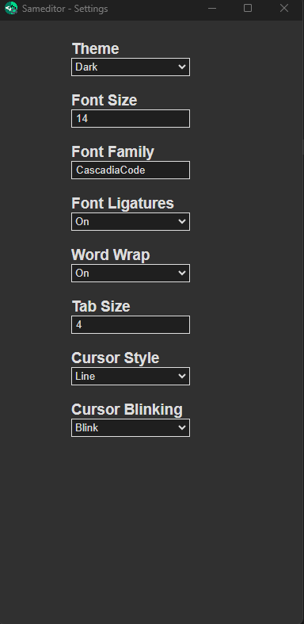

A simple editor, made with monaco-editor (the same editor that vscode uses).
It has a theme system that makes it completely customizable and a terminal feature.

## Instalation

linux (debian):

1. npm install | yarn install
2. sudo npm run build-linux
3. sudo dpkg -i dist/sameditor_X.Y.Z_amd64.deb

windows:

1. open cmd or powershell as an administrator
2. npm install | yarn install
3. npm run build-windows
4. dist/sameditor_X.Y.Z.exe

or install from releases in the github repo: https://github.com/ProcapYT/sameditor

## Usage

To create a theme click on the menu: themes -> create new theme
or to modify it click: themes -> open themes folder 
and select your theme

To edit your settings by opening the settings window in the menu: settings -> open settings window
or press Ctrl+Coma in the keyboard, another option is to open the settings.json file: settings -> open settings file

